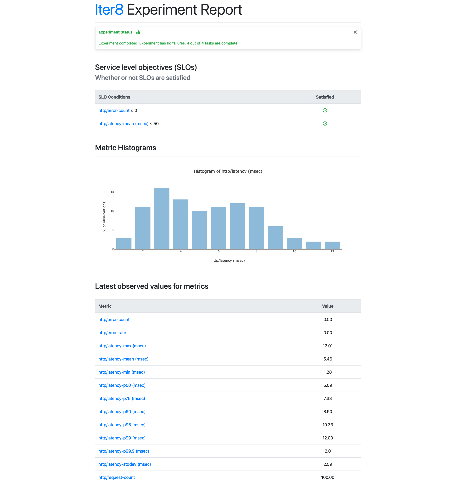

# Automated Experiments with ArgoCD and Iter8

Say you are building a cloud app. Clearly, you will unit test the app during development to ensure that it behaves the way you expect. And no matter how you develop your app, your favorite unit testing tool will make it easy to author, execute and obtain results from your tests.

What about testing your app when you deploy it in a Kubernetes cluster (test/dev/staging/prod)? Does the app handle realistic load conditions with acceptable performance? Does the new version of the app improve business metrics relative to the earlier version? Is it resilient?

[Iter8](https://iter8.tools) is an open-source Kubernetes release optimizer that can help you get started with testing of Kubernetes apps in seconds. With Iter8, you can perform various kinds of [experiments](https://iter8.tools/0.13/getting-started/concepts/#iter8-experiment), such as (i) performance testing to ensure that your application can handle realistic load and satisfy SLOs, (ii) A/B(/n) tests that help you split users across app versions, collect business metrics, identify the winning version of your app that optimizes business metrics, and promote the winning version, and (iii) chaos injection tests, and more.

Iter8 is now introducing a new feature: [AutoX](https://iter8.tools/0.13/tutorials/autox/autox/). AutoX, short for automatic experimentation, allows you to perform the above experiments automatically, using a few simple labels on your Kubernetes resources. For instance, you can use the AutoX feature to automatically validate new versions of your app, as they are deployed in the cluster. Under the covers, AutoX is leveraging [Argo CD](https://argo-cd.readthedocs.io), a popular GitOps continuous delivery tool, to launch these experiments.

In this article, we will explore automatically launching performance testing experiments for an HTTP service deployed in Kubernetes. At the end of this article, you should have everything you need to try out AutoX on your own!

Before trying out the hands-on tutorial documented in this article, you may wish to familiarize yourself with Iter8 [here](https://iter8.tools).

### AutoX


AutoX will detect changes to your Kubernetes resources and automatically launch new experiments. To go into more detail, as a user of AutoX, you will need to specify your resources and the experiments you would like to run. Then, AutoX will watch those resources for an updates. If the resources have been changed, then AutoX will make an additional check on its labels. This label check, which we will go into greater detail later, ensures that AutoX should relaunch experiments for these resources and that the resources have been changed significantly enough to warrant the relaunch. Therefore, if the resources have changed and the label check has passed, then AutoX will relaunch the experiments.

In the following tutorial, we will deploy an HTTP service and set up AutoX such that whenever the HTTP service is modified, AutoX will start a new HTTP SLO validation test that will check if the HTTP service meets minimum latency and error-related requirements.

##### Download Iter8 CLI

The Iter8 CLI provides a number of functions like launching experiments and viewing the results. In this tutorial, AutoX will launch the experiments but we will need the CLI in order to see the results.

```bash
brew tap iter8-tools/iter8
brew install iter8@0.13
```

See [here](https://iter8.tools/0.11/getting-started/install/) for alternate methods of installation.

##### Setup Kubernetes cluster with ArgoCD

As mentioned previously, AutoX is built on top of ArgoCD, so we will also need to install it.

```bash
kubectl create namespace argocd
kubectl apply -n argocd -f https://raw.githubusercontent.com/argoproj/argo-cd/stable/manifests/install.yaml
```

See [here](https://argo-cd.readthedocs.io/en/stable/getting_started/#1-install-argo-cd) for more information.

##### Create resource

Now, we will create an `httpbin` deployment and service.

```bash
kubectl create deployment httpbin --image=kennethreitz/httpbin --port=80
kubectl expose deployment httpbin --port=80
```

The `httpbin` deployment will be the resource that AutoX watches, also known as the *trigger*. When changes are made to the trigger, AutoX will relaunch experiments. The `httpbin` service, on the other hand, will not directly used by AutoX. Instead, it will be used by the HTTP SLO validation test, the experiment that will be launched by AutoX.

##### Apply labels

In the previous step, we created the trigger. However, to enable AutoX for this resource, we will need to assign it the `iter8.tools/autox=true` label (referred to as the AutoX label). Otherwise, AutoX will not launch experiments on behalf of this resource.

```bash
kubectl label deployment httpbin iter8.tools/autox=true
```

##### Setup Kubernetes cluster with Iter8 AutoX

Next, we will start the AutoX controller.

```bash
helm repo add iter8 https://iter8-tools.github.io/hub/
helm install autox-httpbin iter8/autox --version 0.1.6 \
--set 'group.httpbin.trigger.name=httpbin' \
--set 'group.httpbin.trigger.namespace=default' \
--set 'group.httpbin.trigger.group=apps' \
--set 'group.httpbin.trigger.version=v1' \
--set 'group.httpbin.trigger.resource=deployments' \
--set 'group.httpbin.specs.iter8.name=iter8' \
--set 'group.httpbin.specs.iter8.values.tasks={ready,http,assess}' \
--set 'group.httpbin.specs.iter8.values.ready.deploy=httpbin' \
--set 'group.httpbin.specs.iter8.values.ready.service=httpbin' \
--set 'group.httpbin.specs.iter8.values.ready.timeout=60s' \
--set 'group.httpbin.specs.iter8.values.http.url=http://httpbin.default/get' \
--set 'group.httpbin.specs.iter8.values.assess.SLOs.upper.http/latency-mean=50' \
--set 'group.httpbin.specs.iter8.values.assess.SLOs.upper.http/error-count=0' \
--set 'group.httpbin.specs.iter8.version=0.13.0' \
--set 'group.httpbin.specs.iter8.values.runner=job'
```

The configuration of the AutoX controller is composed of a *trigger definition* and a set of *experiment charts*. In this case, the trigger is the `httpbin` deployment and there is only one experiment chart, an HTTP SLO validation test. 

To go into more detail, the configuration is a set of *release groups*, and each release group is composed of a trigger definition and a set of *experiment specs*. In this case, there is only one release group named `httpbin` (`group.httpbin...`), and within that release group, there is a trigger (`group.httpbin.trigger...`) and an experiment spec named `iter8` (`group.httpbin.specs.iter8...`). Additional experiment specs can be added for each release group, and the configuration can have multiple release groups.

The trigger definition is a combination of the name, namespace, and GVR, in this case `httpbin`, `default`, and GVR `apps`, `deployments`, and `v1`, respectively. 

The experiment chart is, an HTTP SLO validation test on the `httpbin` service. This Iter8 experiment is composed of three tasks, `ready`, `http`, and `assess`. The `ready` task will ensure that the `httpbin` deployment and service are running. The `http` task will make requests to the specified URL and will collect latency and error-related metrics. Lastly, the `assess` task will ensure that the mean latency is less than 50 milliseconds and the error count is 0. In addition, the runner is set to job as this will be a [single-loop experiment](https://iter8.tools/0.11/getting-started/concepts/#iter8-experiment).

##### Observe automatic experiment

After starting AutoX, the HTTP SLO validation test should quickly follow. You can now use the Iter8 CLI in order to check the status and see the results of the test. 

The following command allows you to check the status of the test. Note that you need to specify an experiment group via the `-g` option. The experiment group for experiments started by AutoX is in the form `autox-<release group spec name>-<experiment spec name>` so in this case, it would be `autox-httpbin-iter8`.

```bash
iter8 k assert -c nofailure -c slos -g autox-httpbin-iter8
```

We can see in the sample output that the test has completed and all SLOs and conditions were satisfied.
```
INFO[2023-01-11 14:43:45] inited Helm config                           
INFO[2023-01-11 14:43:45] experiment has no failure                    
INFO[2023-01-11 14:43:45] SLOs are satisfied                           
INFO[2023-01-11 14:43:45] all conditions were satisfied  
```

***

The following command allows you to see the results of the test.

```bash
iter8 k report -g autox-httpbin-iter8
```

In the sample output, we can see a summary, a list of SLOs and whether they were satisfied or not, as well as any additional metrics that were collected as part of the test.
```
Experiment summary:
*******************

  Experiment completed: true
  No task failures: true
  Total number of tasks: 4
  Number of completed tasks: 4

Whether or not service level objectives (SLOs) are satisfied:
*************************************************************

  SLO Conditions                 | Satisfied
  --------------                 | ---------
  http/error-count <= 0          | true
  http/latency-mean (msec) <= 50 | true
  

Latest observed values for metrics:
***********************************

  Metric                     | value
  -------                    | -----
  http/error-count           | 0.00
  http/error-rate            | 0.00
  http/latency-max (msec)    | 12.01
  http/latency-mean (msec)   | 5.46
  http/latency-min (msec)    | 1.28
  http/latency-p50 (msec)    | 5.09
  http/latency-p75 (msec)    | 7.33
  http/latency-p90 (msec)    | 8.90
  http/latency-p95 (msec)    | 10.33
  http/latency-p99 (msec)    | 12.00
  http/latency-p99.9 (msec)  | 12.01
  http/latency-stddev (msec) | 2.59
  http/request-count         | 100.00
```

***

You can also produce an HTML report that you can view in the browser.

```bash
iter8 k report -g autox-httpbin-iter8 -o html > report.html
```

The HTML report will look similar to the following:


##### Update the resource

Now that AutoX is watching the `httpbin` deployment, any update will relaunch the HTTP SLO validation test. However, the update must also include a change to its *trigger labels*.

The purpose of the *trigger label check* is to ensure that AutoX does not relaunch experiments with every update to the trigger. For example, you may not want AutoX to relaunch experiments when the `status` is changing.

Currently, the trigger labels are `app.kubernetes.io/name"` and `app.kubernetes.io/version`.

For simplicity, we will simply add the version label to the deployment in order to relaunch the HTTP SLO validation test, but in the real world, you would not just change a trigger label. Instead, a update to the trigger would be accompanied by a trigger label change.

```bash
kubectl label deployment httpbin app.kubernetes.io/version=1.0.0
```

##### Observe new automatic experiment

Check if a new experiment has been launched. Refer to [Observe automatic experiment](#observe-automatic-experiment) for the necessary commands.

If we were to continue to update the trigger (as well as the trigger labels), then AutoX would continue to relaunch the experiment.

### More things you can do

Firstly, the HTTP SLO validation test is flexible, and you can augment it a number of ways, such as adding headers, providing a payload, or modulating the query rate. To learn more, see the [documentation](https://iter8.tools/0.13/user-guide/tasks/http/) for the `httpbin` task.

AutoX can also watch any kind of Kubernetes resources, including CRDs such as KNative services or ML models. You are not required to watch deployments. 

AutoX can automate other kinds of experiments. For example, instead of using the `httpbin` task, you can use `grpc` task in order to run an GRPC SLO validation test. Here is the [documentation](https://iter8.tools/0.13/user-guide/tasks/grpc/) for the `grpc` task as well as a [tutorial](https://iter8.tools/0.13/tutorials/load-test-grpc/) for GRPC SLO Validation.

Furthermore, you can add tasks in order to automate more complex experiments. For example, you can add a `slack` task so that your experiment results will be posted on Slack. That way, you can automatically have the lastest performance statistics after every update. Here is the [documentation](https://iter8.tools/0.13/user-guide/tasks/slack/) for the `slack` task as well as a [tutorial](https://iter8.tools/0.13/tutorials/integrations/slack/) for using the Slack task.

You can also automate experiments that are not from Iter8. For example, a Litmus Chaos chaos experiment is available on Iter8 hub. Be sure to check what other experiments are available to use.

Lastly, recall that you can provide multiple release groups and experiment specs so AutoX can launch a whole suite of experiments if that is what you need.

### Takeaways

AutoX is a powerful new feature of Iter8 that lets you automatically launch performance experiments on your Kubernetes applications as soon as you update them. Configuring AutoX is straightforward too, and just requires specifying a trigger resource and the experiments you want to launch. After trying out the tutorial, consider trying it out on your own Kubernetes apps. Please see the [Iter8 documentation](https://iter8.tools) for more information about AutoX, experiments, tasks, and much more! If you need any help, you can find us on [Slack](https://join.slack.com/t/iter8-tools/shared_invite/zt-awl2se8i-L0pZCpuHntpPejxzLicbmw) where we are happy to answer any questions.