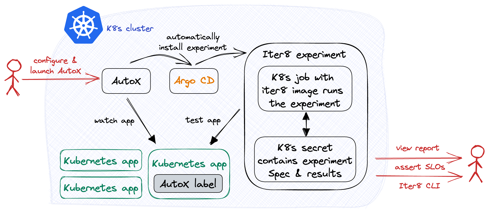

# Automated Experiments with ArgoCD and Iter8

Say you are building a cloud app. Clearly, you will unit test the app during development to ensure that it behaves the way you expect. And no matter how you develop your app, your favorite unit testing tool will make it easy to author, execute and obtain results from your tests.

What about testing your app when you deploy it in a Kubernetes cluster (test/dev/staging/prod)? Does the app handle realistic load conditions with acceptable performance? Does the new version of the app improve business metrics relative to the earlier version? Is it resilient?

[Iter8](https://iter8.tools) is an open-source Kubernetes release optimizer that can help you get started with testing of Kubernetes apps in seconds. With Iter8, you can perform various kinds of experiments, such as SLO validation, canary tests, A/B(/n) tests, and chaos injection tests, and use these experiments to discover which of your services is performing the best. These experiments are composed of various discrete tasks, which can perform different functions such as waiting for services to start, collecting metrics from services, and validating those metrics against SLOs, so you can customize experiments to fit your exact use case. All in all, Iter8 can help you get the most out of your Kubernetes apps and ML-models quickly and easily.

Iter8 is now introducing a new feature: AutoX. AutoX, short for automatic experimentation, allows Iter8 to detect new versions of your services and automatically trigger new experiments, allowing you to tests your services as soon as you push out a new version. Under the covers, AutoX is leveraging [Argo CD](https://argo-cd.readthedocs.io), a popular GitOps continuous delivery tool, to start these automatic experiments. Thus, AutoX greatly expands on functionality that Iter8 already provides.

In this article, we will explore automatically launching performance testing experiments for an HTTP service deployed in Kubernetes. At the end of this article, you should have everything you need to try out AutoX on your own!

Before trying out the hands-on tutorial documented in this article, you may wish to familiarize yourself with Iter8 [here](https://knative.dev/blog/articles/performance-test-with-slos/).

### AutoX



Earlier, we described AutoX as detecting new versions of your services and automatically triggering experiments. To be more exact, AutoX detects changes to a particular set of labels from a particular Kubernetes resource and will execute Iter8 experiments based on those labels. For example, when a deployment is updated and its version label is bumped, AutoX can spin up a new SLO test to see if the new version satisifies requirements.

In order for AutoX to function, you must specify a trigger and a set of experiment charts. The trigger specifies the Kubernetes resource object that AutoX should watch and the experiment charts specify the Iter8 experiments AutoX should launch. 

The trigger is a combination of name, namespace, and GVR (group, version, resource). When a particular set of labels of a matching resource is changed **and** the resource continues to have an `iter8.tools/autox-group` label (referred to as the AutoX label for the remainder of the article) then AutoX will launch the experiments. The labels that need to be changed are the following: `app.kubernetes.io/name"`, `app.kubernetes.io/version"`, `iter8.tools/track"`, and `autoXAdditionalValues` (referred to as the trigger labels for the remainder of the article).

The experiment charts come from [Iter8 Hub](https://github.com/iter8-tools/hub). Iter8 Hub primarily contains Iter8 experiments but it also contains other experiments such as Litmus-based chaos injection experiments.

<!-- As mentioned previously, AutoX is utilizing Argo CD. Iter8 uses Argo CD to install these experiment charts. The Helm charts could contain an Iter8 experiment, which would allow automatic experimentation to occur. However, the Helm charts are not limited to just Iter8 experiments and could contain other things such as a Litmus Chaos chaos experiment. -->

<!-- Different behaviors will occur based on what kind of change has occured on the watched Kubernetes resource object. If a change is made on a Kubernetes resource object that does not have the AutoX label, then nothing will happen. If a Kubernetes resource object with an AutoX label has been created or if a Kubernetes resource object has been modified to add an AutoX label, then the Helm charts will be installed. If a Kubernetes resource object with an AutoX label has been changed, then the Helm charts will be deleted and reinstalled. However, if part of the change is that the AutoX label was removed, then the charts will not be reinstalled. Lastly, if the Kubernetes resource object with an AutoX label is deleted, then the Helm charts will also be deleted. -->


In the following tutorial, we will deploy an HTTP service and set up AutoX such that whenever the HTTP service is modified, AutoX will start a new HTTP SLO validation test that will check if the HTTP service meets minimum latency and error-related requirements.

##### Setup Kubernetes cluster with ArgoCD

```bash
kubectl create namespace argocd
kubectl apply -n argocd -f https://raw.githubusercontent.com/argoproj/argo-cd/stable/manifests/install.yaml
```

See [here](https://argo-cd.readthedocs.io/en/stable/getting_started/#1-install-argo-cd) for more information.

##### Download Iter8 CLI

```bash
brew tap iter8-tools/iter8
brew install iter8@0.12
```

See [here](https://iter8.tools/0.11/getting-started/install/) for alternate methods of installation.

##### Setup Kubernetes cluster with Iter8 AutoX

```bash
helm repo add iter8 https://iter8-tools.github.io/hub/
helm install autox-httpbin iter8/autox \
--set 'releaseGroupSpecs.httpbin.trigger.name=httpbin' \
--set 'releaseGroupSpecs.httpbin.trigger.namespace=default' \
--set 'releaseGroupSpecs.httpbin.trigger.group=apps' \
--set 'releaseGroupSpecs.httpbin.trigger.version=v1' \
--set 'releaseGroupSpecs.httpbin.trigger.resource=deployments' \
--set 'releaseGroupSpecs.httpbin.releaseSpecs.iter8.name=iter8' \
--set 'releaseGroupSpecs.httpbin.releaseSpecs.iter8.values.tasks={ready,http,assess}' \
--set 'releaseGroupSpecs.httpbin.releaseSpecs.iter8.values.ready.deploy=httpbin' \
--set 'releaseGroupSpecs.httpbin.releaseSpecs.iter8.values.ready.service=httpbin' \
--set 'releaseGroupSpecs.httpbin.releaseSpecs.iter8.values.ready.timeout=60s' \
--set 'releaseGroupSpecs.httpbin.releaseSpecs.iter8.values.http.url=http://httpbin.default/get' \
--set 'releaseGroupSpecs.httpbin.releaseSpecs.iter8.values.assess.SLOs.upper.http/latency-mean=50' \
--set 'releaseGroupSpecs.httpbin.releaseSpecs.iter8.values.assess.SLOs.upper.http/error-count=0' \
--set 'releaseGroupSpecs.httpbin.releaseSpecs.iter8.version=0.12.2' \
--set 'releaseGroupSpecs.httpbin.releaseSpecs.iter8.values.runner=job'
```

As mentioned previously, the input to AutoX is a trigger and a set of experiment charts. Here, the trigger is a Kubernetes resource object with the name `httpbin`, namespace `default`, and GVR `apps`, `deployments`, and `v1`, meaning that AutoX will watch any resource that meets the description. When a changed is made to the trigger labels of a matching resource and the resource continues to have the AutoX label, then AutoX will install the Helm charts.

In this case, there is only one experiment chart to install. The specified experiment chart is pointing to an Iter8 experiment, specifically an HTTP SLO validation test on the `httpbin` service. 

This experiment is composed of three tasks, `ready`, `http`, and `assess`. The `ready` task will ensure that the `httpbin` deployment and service are running. The `http` task will make requests to the specified URL and will collect latency and error-related metrics. Lastly, the `assess` task will ensure that the mean latency is less than 50 milliseconds and the error count is 0. In addition, the runner is set to job as this will be a [single-loop experiment](https://iter8.tools/0.11/getting-started/concepts/#iter8-experiment).

##### Create application

Now, we will create the `httpbin` deployment and service.

```bash
kubectl create deployment httpbin --image=kennethreitz/httpbin --port=80
kubectl expose deployment httpbin --port=80
```

##### Apply labels

In the previous step, we created an `apps/v1` deployment with the name `httpbin` in the `default` namespace, which matches the trigger that we configured for AutoX. However, to enable AutoX for the Kubernetes resource object, we need to assign it the AutoX label.

```bash
kubectl label deployment httpbin iter8.tools/autox=true
```

##### Observe automatic experiment

After you have assigned the AutoX label, an experiment should start.

You can now use `iter8` commands in order to check the status and the results of the experiment. Note that you need to specify an experiment group via the `-g` option. The experiment group for AutoX experiments is in the form `autox-<release group spec name>-<release spec name>`. In this case, it would be `autox-httpbin-iter8`. 

The following command allows you to check the status of the experiment. If the experiment does not immediately start, try waiting a minute.

```bash
iter8 k assert -c nofailure -c slos -g autox-httpbin-iter8
```

We can see in the sample output that the experiment has completed and all SLOs and conditions were satisfied.
```
INFO[2023-01-11 14:43:45] inited Helm config                           
INFO[2023-01-11 14:43:45] experiment has no failure                    
INFO[2023-01-11 14:43:45] SLOs are satisfied                           
INFO[2023-01-11 14:43:45] all conditions were satisfied  
```

And the following command allows you to check the results of the experiment.

```bash
iter8 k report -g autox-httpbin-iter8
```

In the sample output, we can see an experiment summary, a list of SLOs and whether they were satisfied or not, as well as any additional metrics that were collected as part of the experiment.
```
Experiment summary:
*******************

  Experiment completed: true
  No task failures: true
  Total number of tasks: 4
  Number of completed tasks: 4

Whether or not service level objectives (SLOs) are satisfied:
*************************************************************

  SLO Conditions                 | Satisfied
  --------------                 | ---------
  http/error-count <= 0          | true
  http/latency-mean (msec) <= 50 | true
  

Latest observed values for metrics:
***********************************

  Metric                     | value
  -------                    | -----
  http/error-count           | 0.00
  http/error-rate            | 0.00
  http/latency-max (msec)    | 25.11
  http/latency-mean (msec)   | 5.59
  http/latency-min (msec)    | 1.29
  http/latency-p50 (msec)    | 4.39
  http/latency-p75 (msec)    | 6.71
  http/latency-p90 (msec)    | 10.40
  http/latency-p95 (msec)    | 13.00
  http/latency-p99 (msec)    | 25.00
  http/latency-p99.9 (msec)  | 25.10
  http/latency-stddev (msec) | 4.37
  http/request-count         | 100.00
```

##### Push new version of the application

Now that AutoX is watching the `httpbin` deployment, any change that we make to its trigger labels will cause AutoX to trigger a new experiment.

We will trigger a new experiment by adding a new trigger label to the `httpbin` deployment.

```bash
kubectl label deployment httpbin app.kubernetes.io/version=1.0.0
```

##### Observe new automatic experiment

Check to see if a new experiment should have started. Refer to [Observe automatic experiment](#observe-automatic-experiment) for the necessary commands.

##### Discussion

You can continue to modify the `httpbin` deployment to trigger new experiments. For example, you can continue to bump the `app.kubernetes.io/version` label to trigger the HTTP SLO validation test. Now it is easy to know if your app meets basic HTTP performance requirements.

It is possible to use AutoX to conduct more complex experiments. Iter8 experiments are composed from discrete tasks so you can design an experiment that best fits your use case. For example, instead of using the `httpbin` task, you can use `abn` task in order to run an A/B/n experiment. You can also run experiments that are not from Iter8. For example, there is also a experiment chart for a Litmus Chaos chaos experiment. Lastly, you can supply multiple experiments charts so AutoX will deploy a suite of experiments to run whenever you update your trigger resource.

Note that if you delete the AutoX label or if you delete the `httpbin` development, then AutoX will also delete the respective experiments.

### Other variations

A/B(/n) experiment?

With chaos injection test? Multiple tests?

### Next steps

Now that you have tried out AutoX, try it out on your own apps!

### Takeaways

AutoX, auto experimentation, is a powerful new feature of Iter8 that can let you automatically run performance tests on your Kubernetes apps and ML-models.

After trying out the tutorial, consider trying it out on your own services. If you need any help, you can find us on [Slack](https://join.slack.com/t/iter8-tools/shared_invite/zt-awl2se8i-L0pZCpuHntpPejxzLicbmw) where we are happy to answer any questions.